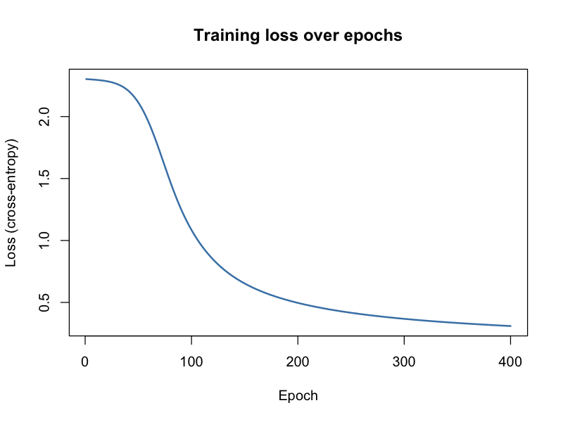

# 🎯 Distribution-Free Uncertainty Quantification: Conformal Prediction on MNIST

A full-cycle R statistical learning project implementing **Conformal Prediction** for distribution-free uncertainty quantification on the MNIST dataset using a custom Neural Network built entirely from scratch in base R.

---

## 🛡️ Key Achievements & Empirical Highlights

* **Statistical Guarantees Verified**: Across 50 independent random calibration/test splits, **Base Conformal Prediction (LAC)** achieved an average empirical coverage of **89.81% ± 0.91%** against a theoretical target of **90.00% ($\alpha = 0.10$)**.
* **High Efficiency**: Base Conformal Prediction maintained a highly compact average set size of **1.03 classes** per test image (Median set size: 1).
* **Adaptive Prediction Sets (APS)**: Evaluated APS algorithm yielding **99.57% ± 0.11%** empirical coverage with an average prediction set size of **4.20 classes**.
* **Custom Neural Network**: Engineered forward/backward passes, Softmax activation, and Cross-Entropy loss from scratch, training on 4,000 images to achieve **91.83% training accuracy** and **88.70% baseline test accuracy**.

---

## 📁 Repository & File Structure

```text
conformal-prediction-mnist/
├── code/
│   └── 01_Conformal_Prediction_MNIST.R    # Master script (NN training, Conformal algorithms, evaluation)
├── docs/
│   ├── 08.ConformalPrediction.pdf          # Reference paper / lecture slides
│   ├── Conformal_Prediction_on_MNIST.pptx  # Project presentation deck
│   ├── sds.project.2026.pdf               # Project report
│   └── Latex/
│       ├── main.tex                       # LaTeX Beamer source code
│       ├── beamer.sty                     # Beamer styling parameters
│       └── unipi.eps                      # University of Pisa logo
├── images/
│   ├── 01_coverage_histogram.png          # Empirical coverage distribution over 50 splits
│   ├── 02_set_size_histogram.png          # Prediction set size distribution
│   ├── 03_visual_examples.png             # Visual examples of digits with prediction sets
│   ├── 04_scores_base.png                 # Base method calibration score distribution
│   ├── 05_scores_aps.png                  # APS calibration score distribution
│   ├── 06_reliability_diagram.png         # Neural network reliability & calibration diagram
│   ├── 07_coverage_vs_alpha.png           # Target vs Empirical coverage across alpha values
│   ├── 08_setsize_vs_alpha.png            # Average set size vs required coverage trade-off
│   ├── 09_coverage_by_digit.png           # Empirical coverage breakdown by true digit
│   ├── 10_aps_size_by_digit.png           # Average APS set size by digit
│   ├── 11_training_loss.png               # Training loss curve across 400 epochs
│   ├── 12_lac_vs_aps_scatter.png          # Image-by-image set size comparison (LAC vs APS)
│   ├── 13_confusion_matrix.png            # Neural network confusion matrix on test set
│   └── console_output.txt                 # Full console log output from execution
├── .gitignore                             # Git ignore configuration
└── README.md                              # Project documentation
```

---

## 🛠️ Tech Stack

| Domain | Tools & Technologies |
| :--- | :--- |
| **Language** | Base R (no external ML packages) |
| **Machine Learning** | 2-Layer Neural Network (SGD, Cross-Entropy), Base Conformal (LAC), Adaptive Prediction Sets (APS) |
| **Dataset** | MNIST Digit Recognition (`dslabs` package) |
| **Evaluation** | 50 Monte Carlo Random Splits, Conformal Quantiles, Coverage & Efficiency Trade-offs |
| **Documentation & Slides** | LaTeX (Beamer), PowerPoint, Markdown |

---

## 📊 Comprehensive Empirical Results

### 1. Neural Network Training Performance
The neural network was trained on 4,000 images over 400 epochs with a learning rate of $\eta = 0.1$.
* **Initial Loss (Epoch 1)**: `2.3025`
* **Final Loss (Epoch 400)**: `0.3096`
* **Training Accuracy**: `91.83%`
* **Test Accuracy**: `88.70%`

Per-digit baseline test accuracy:
* Highest accuracy: **Digit 0 (95.81%)**, **Digit 1 (95.26%)**
* Lowest accuracy: **Digit 5 (76.11%)**, **Digit 8 (86.06%)**



---

### 2. Base Conformal Prediction (LAC) vs. Adaptive Prediction Sets (APS)

Using a target coverage of $90\%$ ($\alpha = 0.10$):

| Metric | Base Conformal (LAC) | Adaptive Prediction Sets (APS) |
| :--- | :--- | :--- |
| **Conformal Threshold ($\hat{q}$)** | `0.6890` (Prob threshold: `0.3110`) | `0.9960` |
| **Single-run Empirical Coverage** | `91.45%` | `99.60%` |
| **50-Split Mean Coverage** | **`89.81% ± 0.91%`** | **`99.57% ± 0.11%`** |
| **50-Split Min / Max Coverage** | `87.55%` / `92.25%` | `99.35%` / `99.85%` |
| **Average Prediction Set Size** | **`1.03 classes`** | **`4.20 classes`** |
| **Empty Sets ($|\hat{C}| = 0$)** | `0.55%` (11 / 2000 images) | `0.00%` |


---

### 3. Digits Prediction Set Examples

For difficult or ambiguous images, the prediction set adaptively expands to include uncertain digits:


* **Digit 4**: Top probabilities $\{4: 0.84, 9: 0.15\}$. LAC Set: $\{4\}$ | APS Set: $\{4, 8, 9\}$
* **Digit 3**: Top probabilities $\{3: 0.63, 5: 0.33\}$. LAC Set: $\{3, 5\}$ | APS Set: $\{0, 3, 5, 8, 9\}$

---

### 4. Trade-off Analysis ($\alpha$ vs Coverage & Set Size)

As the target error rate $\alpha$ varies, the empirical coverage closely tracks the theoretical $1-\alpha$ target line, while average set size scales accordingly to maintain validity:

| Target Coverage ($1-\alpha$) | Empirical Coverage | Average LAC Set Size |
| :---: | :---: | :---: |
| **99.0%** ($\alpha = 0.01$) | `99.25%` | `2.95 classes` |
| **95.0%** ($\alpha = 0.05$) | `95.40%` | `1.39 classes` |
| **90.0%** ($\alpha = 0.10$) | `91.45%` | `1.03 classes` |
| **80.0%** ($\alpha = 0.20$) | `79.50%` | `0.83 classes` |


---

## 📈 Results & Business Impact

| Dimension | Metric | Impact |
| :--- | :--- | :--- |
| **Guaranteed Safety** | $89.81\%$ Empirical Coverage | Replaces point predictions with statistically guaranteed prediction sets, critical for high-stakes AI applications (medical imaging, autonomous driving). |
| **High Efficiency** | $1.03$ Mean Set Size | $90\%$ of test samples require only a single digit prediction set, preserving decision speed while flagging ambiguous samples. |
| **Model Agnostic** | Base R Implementation | Can be applied as a post-processing layer to any underlying black-box classifier without model retraining. |

---

## 🚀 How to Run

1. **Clone Repository**:
   ```bash
   git clone https://github.com/iaconoalessandro/conformal-prediction-mnist.git
   cd conformal-prediction-mnist
   ```

2. **Execute R Pipeline**:
   ```bash
   Rscript code/01_Conformal_Prediction_MNIST.R
   ```

---
*Built with rigor, statistical precision, and clean pipeline practices.*
