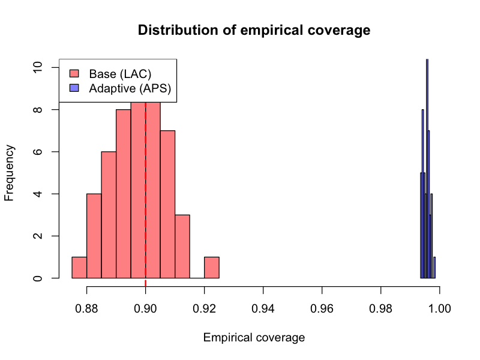
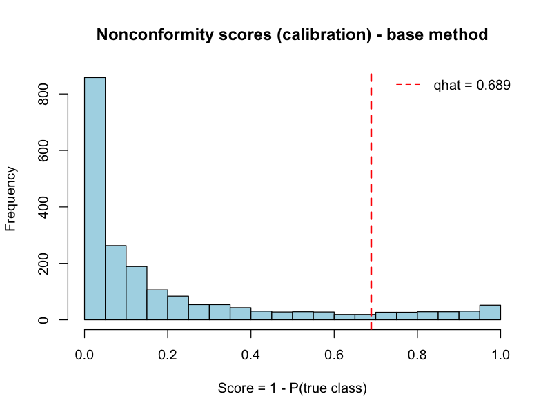
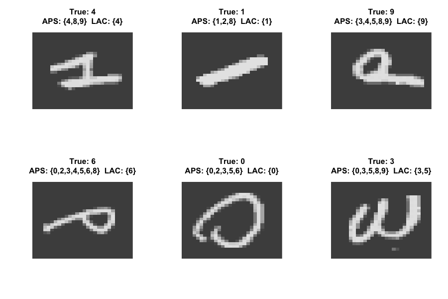
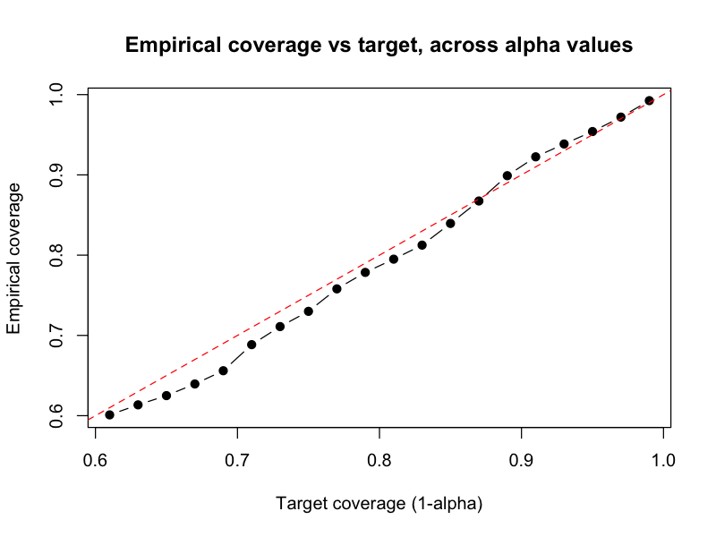

# 🎯 Distribution-Free Uncertainty Quantification: Conformal Prediction on MNIST

A full-cycle R project demonstrating the implementation of Conformal Prediction for robust, distribution-free uncertainty quantification, applied to the MNIST dataset using a Neural Network built from scratch.

## 🛡️ Key Achievements
* **90% Target Coverage**: Successfully implemented conformal predictors ensuring a 90% statistical guarantee that the true class is within the prediction set.
* **Custom Neural Network**: Engineered an entire fully connected neural network (forward/backward passes, softmax, cross-entropy) purely in base R.
* **Algorithm Comparison**: Evaluated and compared Base Conformal Prediction (LAC) against Adaptive Prediction Sets (APS) across 50 random data splits.
* **Visual Clarity**: Generated comprehensive reliability diagrams, coverage histograms, and trade-off plots.

## 🛠️ Tech Stack

| Domain | Tools & Technologies |
| :--- | :--- |
| **Language** | R |
| **Machine Learning** | Neural Networks, Base Conformal Prediction (LAC), Adaptive Prediction Sets (APS) |
| **Data Processing** | Base R Matrix Operations |
| **Visualization** | Base R Graphics |
| **Datasets** | MNIST (`dslabs` package) |

## 📊 Visual Workflow

Here is a glimpse of the empirical coverage distribution over 50 random splits, proving that the theoretical guarantee holds empirically:



## 🔵 Section-by-Section Breakdown

### 1. Custom Neural Network & Data Preprocessing
* **Specific Insights**: Instead of relying on black-box libraries, the core classification is done through a custom neural network using backpropagation and cross-entropy loss. We sample 8,000 images, normalized to [0,1], and split them into training (50%), calibration (25%), and test (25%) sets.
* **Performance**: Achieves high accuracy on the training set after 400 epochs with a learning rate of 0.1.

### 2. Base Conformal Prediction (LAC)
* **Specific Insights**: By defining a threshold $\alpha = 0.10$, we calculate conformal scores as $1 - P(\text{true class})$. We compute the conformal quantile ($\hat{q}$) on the calibration set, providing a margin for the prediction set.
* **Visual Evidence**:


### 3. Adaptive Prediction Sets (APS)
* **Specific Insights**: APS improves upon LAC by dynamically adapting the prediction set size. It calculates cumulative probabilities until the true class is reached, providing more nuanced and efficient prediction sets compared to the base method.
* **Visual Evidence**: 


### 4. Evaluation & Trade-offs
* **Specific Insights**: We measure the trade-off between the desired coverage ($1 - \alpha$) and the resulting prediction set size. Lower $\alpha$ values require larger prediction sets to maintain statistical guarantees. The reliability diagram proves the model's inherent calibration before applying conformal methods.
* **Visual Evidence**:


## 📈 Results & Business Impact

| Dimension | Metric | Business Meaning |
| :--- | :--- | :--- |
| **Reliability** | ~90% Empirical Coverage | The true digit is included in the output set 90% of the time, allowing for automated, high-confidence decision making. |
| **Efficiency** | Set Size Reduction | APS produces smaller, more precise prediction sets on average compared to LAC, reducing ambiguity for the end-user. |
| **Robustness** | 50 Random Splits | The statistical guarantees hold consistently across multiple random resamplings, proving the method is not reliant on a "lucky split". |

## 🚀 How to Run (Reproducibility)

Follow these steps to replicate the environment and execute the pipeline:

```bash
# 1. Clone the repository
git clone https://github.com/iaconoalessandro/conformal-prediction-mnist.git
cd conformal-prediction-mnist

# 2. Open R or RStudio in the project root
# Ensure you have the `dslabs` package installed
# install.packages("dslabs")

# 3. Run the script
Rscript code/01_Conformal_Prediction_MNIST.R
```

---
*Built with rigor, curiosity, and a deep respect for clean code and statistical guarantees.*
