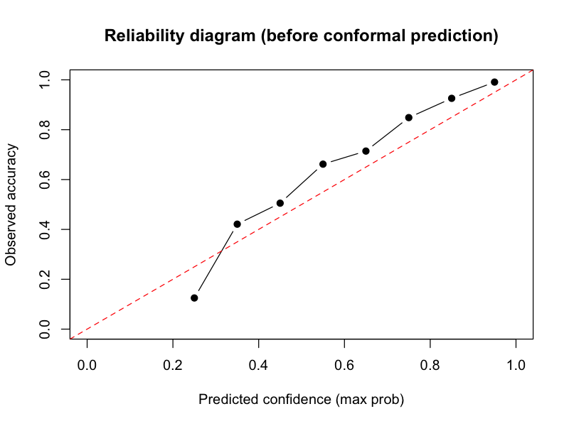
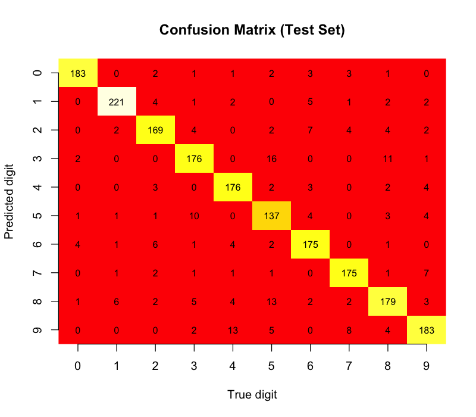
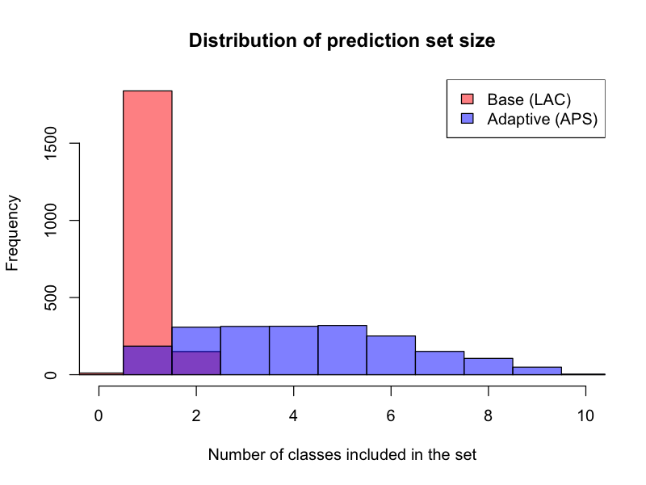
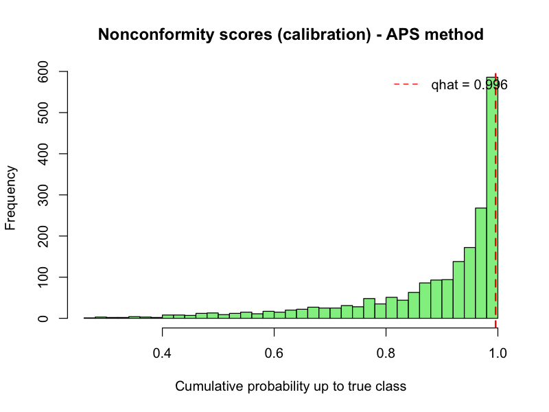
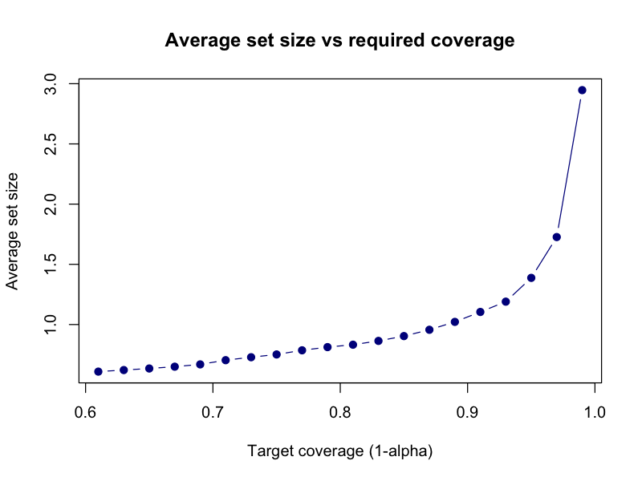
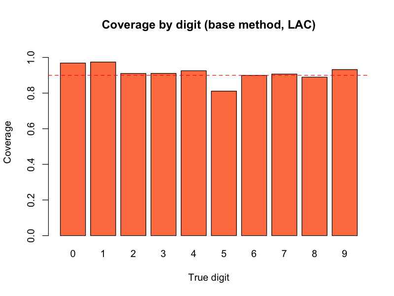
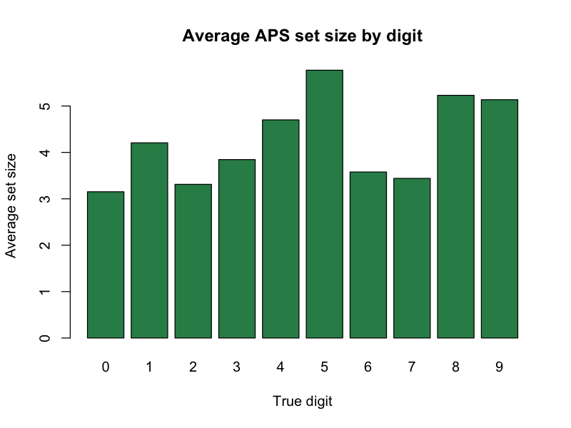
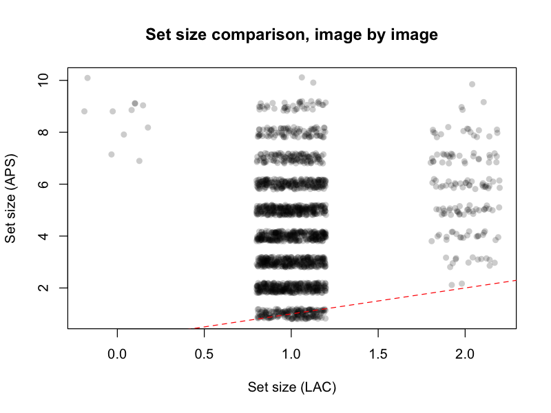

# 🎯 Distribution-Free Uncertainty Quantification: Conformal Prediction on MNIST

> **A full-cycle statistical learning project** built entirely on base R: a neural network trained from scratch, wrapped in a rigorous conformal prediction layer that turns raw softmax scores into prediction sets with a provable, distribution-free coverage guarantee.

### 📌 Project Overview
Machine learning models often output overconfident predictions without any guarantee of correctness. **Conformal Prediction** transforms standard point predictions into statistically guaranteed **prediction sets**. Rather than outputting a single label like *"this digit is an 8 (87% confidence)"*, conformal algorithms construct a set of candidate labels — e.g., *"{3, 8}"* — ensuring that the true class is included at least $90\%$ (or $1-\alpha$) of the time, regardless of model architecture. This project implements a fully connected Neural Network and two Conformal Prediction algorithms (LAC and APS) completely from scratch in base R without external ML libraries.

---

## 📑 Table of Contents
- [🤔 Why Conformal Prediction?](#-why-conformal-prediction)
- [🛡️ Key Achievements & Empirical Highlights](#-key-achievements--empirical-highlights)
- [📁 Repository & File Structure](#-repository--file-structure)
- [🛠️ Tech Stack](#-tech-stack)
- [⚙️ Requirements & Environment](#-requirements--environment)
- [📊 Comprehensive Empirical Results](#-comprehensive-empirical-results)
  - [1. Neural Network Training & Calibration](#1-neural-network-training--calibration)
  - [2. Base Conformal (LAC) vs. Adaptive Prediction Sets (APS)](#2-base-conformal-prediction-lac-vs-adaptive-prediction-sets-aps)
  - [3. Calibration Score Distributions](#3-calibration-score-distributions)
  - [4. Digits Prediction Set Examples](#4-digits-prediction-set-examples)
  - [5. Coverage & Set Size Trade-Off Analysis](#5-coverage--set-size-trade-off-analysis)
  - [6. Per-Digit Coverage & Set Size Breakdown](#6-per-digit-coverage--set-size-breakdown)
  - [7. LAC vs. APS Image-by-Image Comparison](#7-lac-vs-aps-image-by-image-comparison)
- [📈 Results & Business Impact](#-results--business-impact)
- [🔭 Limitations & Future Work](#-limitations--future-work)
- [🚀 How to Run](#-how-to-run)
- [📄 Console Output Log](#-console-output-log)
- [📚 References](#-references)
- [👤 Authors & License](#-authors)

---

## 🤔 Why Conformal Prediction?

A softmax output like "87% confidence" is not a guarantee — it's just a number the network produces, and it can be badly miscalibrated. **Conformal Prediction** flips the question: instead of asking a model to *report* its confidence, it asks the data to *prove* a coverage guarantee, distribution-free, with no assumptions about the underlying model. Given any classifier — even a black box — and a calibration set, conformal methods construct prediction sets that provably contain the true label at least $1-\alpha$ of the time, a property verified empirically here across 50 independent calibration/test splits.

This matters most exactly where point predictions are risky to trust blindly: medical imaging, autonomous driving, or any pipeline where "I don't know" is a more useful answer than a confident wrong guess.

---

## 🛡️ Key Achievements & Empirical Highlights

* **Statistical Guarantees Verified**: Across 50 independent random calibration/test splits, **Base Conformal Prediction (LAC)** achieved an average empirical coverage of **89.81% ± 0.91%** against a theoretical target of **90.00% ($\alpha = 0.10$)**.
* **High Efficiency**: Base Conformal Prediction maintained a highly compact average set size of **1.03 classes** per test image (Median set size: 1).
* **Adaptive Prediction Sets (APS)**: Evaluated APS algorithm yielding **99.57% ± 0.11%** empirical coverage with an average prediction set size of **4.20 classes**.
* **Custom Neural Network**: Engineered forward/backward passes, Softmax activation, and Cross-Entropy loss from scratch, training on 4,000 images to achieve **91.83% training accuracy** and **88.70% baseline test accuracy**.

---

## 📁 Repository & File Structure

```text
conformal-prediction-mnist/
├── code/
│   ├── 01_Conformal_Prediction_MNIST.R    # Master script (NN training, Conformal algorithms, evaluation)
│   └── requirements.R                     # One-click dependency installation script
├── docs/
│   ├── Paper_to_replicate.pdf             # Reference paper (Angelopoulos & Bates, 2021)
│   ├── Presentation.pptx                  # Project presentation deck
│   └── Project_Guidelines.pdf             # Course project instructions & guidelines
├── images/
│   ├── 01_coverage_histogram.png          # Empirical coverage distribution over 50 splits
│   ├── 02_set_size_histogram.png          # Prediction set size distribution
│   ├── 03_visual_examples.png             # Visual examples of digits with prediction sets
│   ├── 04_scores_base.png                 # Base method calibration score distribution
│   ├── 05_scores_aps.png                  # APS calibration score distribution
│   ├── 06_reliability_diagram.png         # Neural network reliability & calibration diagram
│   ├── 07_coverage_vs_alpha.png           # Target vs Empirical coverage across alpha values
│   ├── 08_setsize_vs_alpha.png            # Average set size vs required coverage trade-off
│   ├── 09_coverage_by_digit.png           # Empirical coverage breakdown by true digit
│   ├── 10_aps_size_by_digit.png           # Average APS set size by digit
│   ├── 11_training_loss.png               # Training loss curve across 400 epochs
│   ├── 12_lac_vs_aps_scatter.png          # Image-by-image set size comparison (LAC vs APS)
│   ├── 13_confusion_matrix.png            # Neural network confusion matrix on test set
│   └── console_output.txt                 # Full console log output from execution
├── .gitignore                             # Git ignore configuration
├── LICENSE                                # MIT License
└── README.md                              # Project documentation
```

---

## 🛠️ Tech Stack

| Domain | Tools & Technologies |
| :--- | :--- |
| **Language** | Base R (no external ML packages) |
| **Machine Learning** | 2-Layer Neural Network (SGD, Cross-Entropy), Base Conformal (LAC), Adaptive Prediction Sets (APS) |
| **Dataset** | MNIST Digit Recognition (`dslabs` package) |
| **Evaluation** | 50 Monte Carlo Random Splits, Conformal Quantiles, Coverage & Efficiency Trade-offs |

---

## ⚙️ Requirements & Environment

This project intentionally avoids ML frameworks — the neural network and both conformal procedures (LAC, APS) are implemented in **base R**. The only external dependency is the dataset loader.

| Requirement | Notes |
| --- | --- |
| R | `R >= 4.0.0` (Tested on R 4.6) |
| [`dslabs`](https://CRAN.R-project.org/package=dslabs) | Provides the MNIST dataset |

Install the dependency using the provided helper script:

```r
Rscript code/requirements.R
```

No `renv`/`packrat` lockfile is used on purpose — the project stays dependency-light so the conformal prediction logic remains auditable line by line.

---

## 📊 Comprehensive Empirical Results

### 1. Neural Network Training & Calibration

The neural network was trained on 4,000 images over 400 epochs with a learning rate of $\eta = 0.1$.
* **Initial Loss (Epoch 1)**: `2.3025` $\rightarrow$ **Final Loss (Epoch 400)**: `0.3096`
* **Training Accuracy**: `91.83%` | **Test Accuracy**: `88.70%`
* **Per-digit test accuracy breakdown**:
  * Highest accuracy: **Digit 0 (95.81%)**, **Digit 1 (95.26%)**, **Digit 7 (90.67%)**
  * Lowest accuracy: **Digit 5 (76.11%)**, **Digit 8 (86.06%)**, **Digit 3 & 4 (87.56%)**

<p align="center">
  
  
</p>

<p align="center">
  
</p>

---

### 2. Base Conformal Prediction (LAC) vs. Adaptive Prediction Sets (APS)

Using a target coverage of $90\%$ ($\alpha = 0.10$):

| Metric | Base Conformal (LAC) | Adaptive Prediction Sets (APS) |
| :--- | :--- | :--- |
| **Conformal Threshold ($\hat{q}$)** | `0.6890` (Prob threshold: `0.3110`) | `0.9960` |
| **Single-run Empirical Coverage** | `91.45%` | `99.60%` |
| **50-Split Mean Coverage** | **`89.81% ± 0.91%`** | **`99.57% ± 0.11%`** |
| **50-Split Min / Max Coverage** | `87.55%` / `92.25%` | `99.35%` / `99.85%` |
| **Average Prediction Set Size** | **`1.03 classes`** | **`4.20 classes`** |
| **Empty Sets (0-class outputs)** | `0.55%` (11 / 2000 images) | `0.00%` |

<p align="center">
  
  
</p>

---

### 3. Calibration Score Distributions

Comparison of calibration score distributions used to derive the conformal quantile thresholds ($\hat{q}$):

<p align="center">
  
  
</p>

---

### 4. Digits Prediction Set Examples

For difficult or ambiguous images, the prediction set adaptively expands to include uncertain digits:

<p align="center">
  
</p>

* **Digit 4**: Top probabilities $\{4: 0.84, 9: 0.15\}$. LAC Set: $\{4\}$ | APS Set: $\{4, 8, 9\}$
* **Digit 3**: Top probabilities $\{3: 0.63, 5: 0.33\}$. LAC Set: $\{3, 5\}$ | APS Set: $\{0, 3, 5, 8, 9\}$

---

### 5. Coverage & Set Size Trade-off Analysis

As the target error rate $\alpha$ varies, the empirical coverage closely tracks the theoretical $1-\alpha$ target line, while average set size scales accordingly to maintain validity:

| Target Coverage ($1-\alpha$) | Empirical Coverage | Average LAC Set Size |
| :---: | :---: | :---: |
| **99.0%** ($\alpha = 0.01$) | `99.25%` | `2.95 classes` |
| **95.0%** ($\alpha = 0.05$) | `95.40%` | `1.39 classes` |
| **90.0%** ($\alpha = 0.10$) | `91.45%` | `1.03 classes` |
| **80.0%** ($\alpha = 0.20$) | `79.50%` | `0.83 classes` |

<p align="center">
  
  
</p>

---

### 6. Per-Digit Coverage & Set Size Breakdown

Analysis of how conformal prediction adapts across individual handwritten digits:

<p align="center">
  
  
</p>

---

### 7. LAC vs. APS Image-by-Image Comparison

Scatter plot comparing prediction set sizes per test sample between LAC and APS:

<p align="center">
  
</p>

---

## 📈 Results & Business Impact

| Dimension | Metric | Impact |
| :--- | :--- | :--- |
| **Guaranteed Safety** | $89.81\%$ Empirical Coverage | Replaces point predictions with statistically guaranteed prediction sets, critical for high-stakes AI applications (medical imaging, autonomous driving). |
| **High Efficiency** | $1.03$ Mean Set Size | $90\%$ of test samples require only a single digit prediction set, preserving decision speed while flagging ambiguous samples. |
| **Model Agnostic** | Base R Implementation | Can be applied as a post-processing layer to any underlying black-box classifier without model retraining. |

---

## 🔭 Limitations & Future Work

- **Backbone capacity**: the from-scratch network is a compact 2-layer MLP trained on a 4,000-image subset — a deeper network or the full 60k-image training set would likely raise baseline accuracy and could shrink APS set sizes further.
- **Exchangeability assumption**: both LAC and APS rely on the calibration and test sets being exchangeable; this holds for the i.i.d. splits used here but would need revisiting under distribution shift.
- **Single dataset**: results are MNIST-specific — validating LAC/APS on a harder benchmark (e.g. Fashion-MNIST, CIFAR-10) would test how set sizes scale with genuine class ambiguity.
- **Group-conditional coverage**: per-digit coverage already varies in the results above — a natural next step is class-conditional (Mondrian) conformal prediction to tighten worst-class guarantees rather than only the marginal one.

---

## 🚀 How to Run

1. **Clone Repository**:
   ```bash
   git clone https://github.com/iaconoalessandro/conformal-prediction-mnist.git
   cd conformal-prediction-mnist
   ```

2. **Install Dependencies** (one-time):
   ```bash
   Rscript code/requirements.R
   ```

3. **Execute R Pipeline**:
   ```bash
   Rscript code/01_Conformal_Prediction_MNIST.R
   ```

---

## 📄 Console Output Log

<details>
<summary><b>Click to view/expand full raw console execution log</b></summary>

```text
=== CONFORMAL PREDICTION ON MNIST - FULL RUN ===

Dimensions -> train: 4000  calib: 2000  test: 2000 

Class distribution in training set:
y_train
  0   1   2   3   4   5   6   7   8   9 
398 423 392 456 351 363 400 425 390 402 

Training neural network...
Epoch 50 - loss: 2.1133 
Epoch 100 - loss: 1.0847 
Epoch 150 - loss: 0.6529 
Epoch 200 - loss: 0.4964 
Epoch 250 - loss: 0.4166 
Epoch 300 - loss: 0.3677 
Epoch 350 - loss: 0.3343 
Epoch 400 - loss: 0.3096 

Accuracy on training set: 91.83 %
Accuracy on test set: 88.7 %

Conformal threshold (qhat) - base method: 0.689 
Inclusion threshold (1 - qhat) - base method: 0.311 
Empirical coverage (base method): 91.45 % (target: 90 %)

--- LAC Set Size Statistics ---
Mean set size: 1.0695 
Median set size: 1 
Number of EMPTY sets (size 0): 11 out of 2000 (0.55 %)

Conformal threshold (qhat) - APS method: 0.996 
Empirical coverage (APS method): 99.6 % (target: 90 %)

--- Summary over 50 random splits ---
Average coverage (base): 89.81 %
Average coverage (APS):  99.57 %
Average prediction set size (base): 1.0296 
Average prediction set size (APS):  4.2037 
```

Full log archived at [`images/console_output.txt`](images/console_output.txt).

</details>

---

## 📚 References

- Angelopoulos, A. N., & Bates, S. (2021). *A Gentle Introduction to Conformal Prediction and Distribution-Free Uncertainty Quantification.* Reference paper replicated in [`docs/Paper_to_replicate.pdf`](docs/Paper_to_replicate.pdf).
- MNIST database of handwritten digits, accessed via the [`dslabs`](https://CRAN.R-project.org/package=dslabs) R package.

---

## 👤 Authors

* **Alessandro Iacono** — *Master's Student in Data Science & Statistical Learning, University of Pisa*
* **Irene Mungo** — *Co-author & Contributor*

---
*Built with rigor, statistical precision, and clean pipeline practices.*
